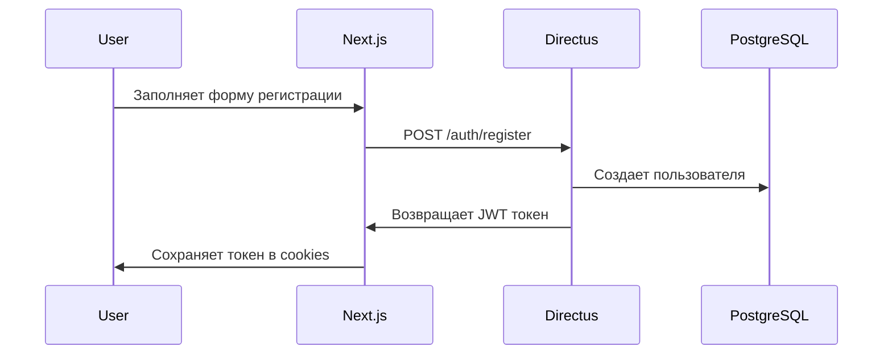
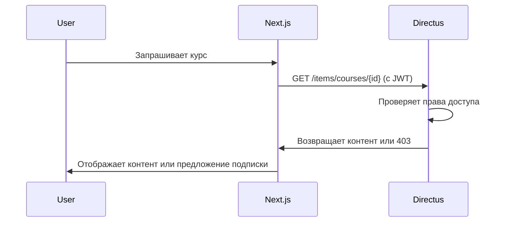

# Архитектура ChildDev с Directus

## Обзор решения

**Directus** выбран как оптимальное backend-решение для образовательной платформы ChildDev на основе следующих критериев:

### Почему Directus?

1. **Полноценная CMS для образовательного контента**
   - Гибкое управление статьями, уроками, курсами
   - Встроенная система ролей и разрешений
   - Интуитивный админ-интерфейс для создания контента

2. **Самостоятельный хостинг и контроль**
   - Данные остаются на нашем сервере
   - Полная кастомизация функционала
   - Нет зависимости от внешних сервисов

3. **Готовые возможности для монетизации**
   - Система пользователей с различными ролями
   - Подписки и платные курсы
   - Интеграция с платежными системами

4. **Масштабируемость для e-commerce**
   - Гибкая схема данных для товаров и заказов
   - Поддержка множественных валют и языков
   - Готовые API для мобильных приложений

## Архитектура системы

```
┌─────────────────┐    ┌─────────────────┐    ┌─────────────────┐
│   Next.js App   │────│   Directus API  │────│   PostgreSQL    │
│   (Frontend)    │    │   (Backend)     │    │   (Database)    │
└─────────────────┘    └─────────────────┘    └─────────────────┘
         │                       │                       │
         │                       │                       │
┌─────────────────┐    ┌─────────────────┐    ┌─────────────────┐
│   PDF Service   │    │   File Storage  │    │   Redis Cache   │
│   (Generators)  │    │   (Images/PDF)  │    │   (Sessions)    │
└─────────────────┘    └─────────────────┘    └─────────────────┘
```

### Компоненты системы

1. **Next.js Frontend** (localhost:3002)
   - Пользовательский интерфейс
   - SSR/SSG для SEO
   - Аутентификация через Directus Auth

2. **Directus Backend** (localhost:8055)
   - REST/GraphQL API
   - Админ-панель контента
   - Система пользователей и ролей

3. **PDF Service** (localhost:3001)
   - Генерация образовательных материалов
   - Интеграция с Directus API

4. **PostgreSQL Database**
   - Основное хранилище данных
   - Пользователи, контент, заказы

5. **Redis Cache**
   - Сессии пользователей
   - Кэширование API ответов

## Схема базы данных

### Основные коллекции

#### 1. Пользователи и роли
```sql
-- users (встроенная коллекция Directus)
id, email, password, first_name, last_name, role, status

-- roles (встроенная коллекция)
id, name, description, permissions

-- user_subscriptions
id, user_id, subscription_type, start_date, end_date, status, payment_method
```

#### 2. Образовательный контент
```sql
-- categories
id, name, slug, description, icon, sort_order, parent_id

-- courses
id, title, slug, description, category_id, difficulty, duration, price, status, thumbnail

-- lessons
id, course_id, title, slug, content, video_url, order, duration, is_free

-- generators
id, name, type, description, params_schema, template_path, status
```

#### 3. Система заданий
```sql
-- assignments
id, user_id, generator_id, params, pdf_url, created_at, completed_at

-- assignment_results
id, assignment_id, score, time_spent, completed_at, feedback
```

#### 4. E-commerce (будущее)
```sql
-- products
id, name, slug, description, price, type, category_id, digital_download_url

-- orders
id, user_id, total, status, payment_method, payment_id, created_at

-- order_items
id, order_id, product_id, quantity, price, total
```

## Поток аутентификации

### 1. Регистрация/Вход


### 2. Доступ к контенту


## Система подписок

### Типы подписок
1. **Бесплатная** - ограниченный доступ к генераторам
2. **Базовая** (299₽/мес) - полный доступ к генераторам
3. **Премиум** (599₽/мес) - генераторы + курсы + индивидуальная поддержка
4. **Семейная** (999₽/мес) - до 5 детских аккаунтов

### Логика доступа
```javascript
// Middleware для проверки доступа
function checkAccess(user, resourceType, resourceId) {
  const subscription = getUserSubscription(user.id)

  switch (resourceType) {
    case 'generator':
      return subscription.type !== 'free' || isFreeLimitNotExceeded(user.id)
    case 'course':
      return ['premium', 'family'].includes(subscription.type)
    case 'support':
      return subscription.type === 'premium'
    default:
      return false
  }
}
```

## E-commerce возможности Directus

### Directus достаточен для интернет-магазина по следующим причинам:

#### 1. Гибкая структура данных
- Любые поля для товаров (цена, описание, характеристики)
- Связи между товарами и категориями
- Варианты товаров (размеры, цвета и т.д.)

#### 2. Управление заказами
- Отслеживание статусов заказов
- История покупок пользователей
- Система скидок и промокодов

#### 3. Интеграции платежей
```javascript
// Пример интеграции с платежными системами
const paymentProviders = {
  yookassa: '/api/payments/yookassa',
  sberbank: '/api/payments/sberbank',
  tinkoff: '/api/payments/tinkoff'
}

// Webhook обработка в Directus Flow
function processPaymentWebhook(data) {
  if (data.status === 'succeeded') {
    updateOrderStatus(data.order_id, 'paid')
    grantAccess(data.user_id, data.product_id)
    sendConfirmationEmail(data.user_id)
  }
}
```

#### 4. Цифровые товары
- Автоматическая выдача доступа после оплаты
- Ссылки на скачивание PDF материалов
- Временные ссылки для защиты контента

#### 5. Многоязычность и валюты
- Поддержка рублей, долларов, евро
- Локализация описаний товаров
- Региональные цены

## План миграции на Directus

### Этап 1: Подготовка инфраструктуры (1-2 недели)
1. **Установка Directus на сервер**
   ```bash
   # На production сервере children.hhivp.com
   docker run -d \
     --name directus \
     -p 8055:8055 \
     -e KEY="your-secret-key" \
     -e SECRET="your-auth-secret" \
     -e DB_CLIENT="pg" \
     -e DB_HOST="postgres" \
     -e DB_PORT="5432" \
     -e DB_DATABASE="childdev" \
     -e DB_USER="directus" \
     -e DB_PASSWORD="secure-password" \
     -e ADMIN_EMAIL="admin@children.hhivp.com" \
     -e ADMIN_PASSWORD="secure-admin-password" \
     directus/directus:latest
   ```

2. **Настройка PostgreSQL**
   - Создание отдельной БД для Directus
   - Настройка бэкапов
   - Оптимизация производительности

3. **Обновление Nginx конфигурации**
   ```nginx
   # Добавить в children.hhivp.com
   location /admin {
       proxy_pass http://localhost:8055;
       proxy_set_header Host $host;
       proxy_set_header X-Real-IP $remote_addr;
   }

   location /api/ {
       proxy_pass http://localhost:8055/;
       proxy_set_header Host $host;
       proxy_set_header X-Real-IP $remote_addr;
   }
   ```

### Этап 2: Проектирование схемы (1 неделя)
1. **Создание коллекций в Directus**
   - Настройка полей и связей
   - Определение разрешений для ролей
   - Импорт существующих данных

2. **Настройка ролей пользователей**
   - Guest (гости) - просмотр бесплатного контента
   - User (пользователи) - базовый доступ
   - Premium (премиум) - расширенный доступ
   - Admin (администраторы) - полный доступ

### Этап 3: Интеграция с Next.js (2-3 недели)
1. **Установка Directus SDK**
   ```bash
   npm install @directus/sdk
   ```

2. **Настройка аутентификации**
   ```javascript
   // lib/directus.js
   import { createDirectus, authentication, rest } from '@directus/sdk'

   const directus = createDirectus('https://children.hhivp.com/api')
     .with(authentication())
     .with(rest())

   export default directus
   ```

3. **Создание API слоя**
   - Обертки для работы с курсами
   - Система управления подписками
   - Интеграция с генераторами

### Этап 4: Система платежей (2 недели)
1. **Интеграция ЮKassa**
   ```javascript
   // Создание платежа
   async function createPayment(subscriptionType, userId) {
     const payment = await yookassa.createPayment({
       amount: { value: getSubscriptionPrice(subscriptionType), currency: 'RUB' },
       payment_method_data: { type: 'bank_card' },
       confirmation: { type: 'redirect', return_url: '/payment/success' },
       metadata: { user_id: userId, subscription_type: subscriptionType }
     })

     return payment.confirmation.confirmation_url
   }
   ```

2. **Webhook обработка**
   - Автоматическое обновление подписок
   - Уведомления пользователей
   - Логирование транзакций

### Этап 5: Контент-менеджмент (1-2 недели)
1. **Создание образовательного контента**
   - Загрузка курсов и уроков
   - Организация по категориям
   - Настройка доступа по подпискам

2. **Интеграция с генераторами**
   - Связывание заданий с пользователями
   - Сохранение результатов и прогресса
   - Система достижений

## Преимущества архитектуры с Directus

### Для разработки
1. **Быстрое создание API** - автоматические REST/GraphQL эндпоинты
2. **Готовая админка** - не нужно создавать панель управления
3. **Типобезопасность** - автогенерация TypeScript типов
4. **Гибкость** - легко добавлять новые поля и коллекции

### Для бизнеса
1. **Контроль над данными** - все на нашем сервере
2. **Масштабируемость** - от MVP до крупной платформы
3. **Экономия времени** - не нужно создавать backend с нуля
4. **Будущие расширения** - готовность к e-commerce, мобильным приложениям

### Для пользователей
1. **Быстрая загрузка** - оптимизированные API запросы
2. **Офлайн доступ** - кэширование контента
3. **Персонализация** - рекомендации на основе прогресса
4. **Удобная оплата** - интеграция с популярными системами

## Риски и митигация

### Потенциальные риски
1. **Сложность настройки** - Directus требует больше начальной настройки
2. **Производительность** - может быть медленнее специализированных решений
3. **Кривая обучения** - команде нужно изучить Directus

### Способы снижения рисков
1. **Поэтапное внедрение** - начинаем с простых функций
2. **Кэширование** - Redis для часто запрашиваемых данных
3. **Документация** - подробные гайды для команды
4. **Бэкапы** - регулярное резервное копирование

## Заключение

Directus обеспечивает оптимальный баланс между функциональностью и простотой для ChildDev платформы. Решение позволяет:

- **Сейчас**: Запустить систему пользователей и подписок
- **В перспективе**: Расширить до полноценного интернет-магазина
- **В будущем**: Добавить мобильные приложения и AI-рекомендации

Архитектура готова к росту от текущих 100-200 пользователей до 10,000+ в перспективе без кардинальных изменений в коде.