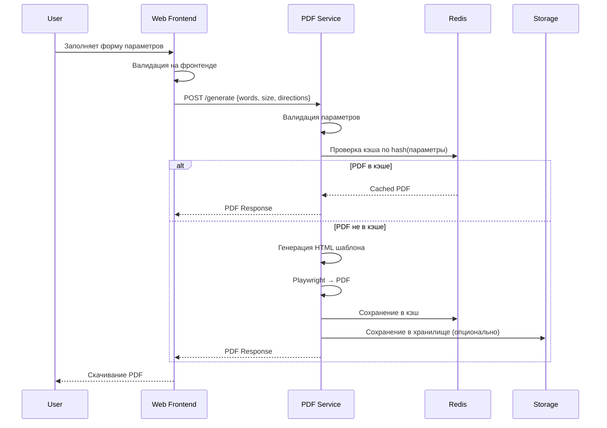
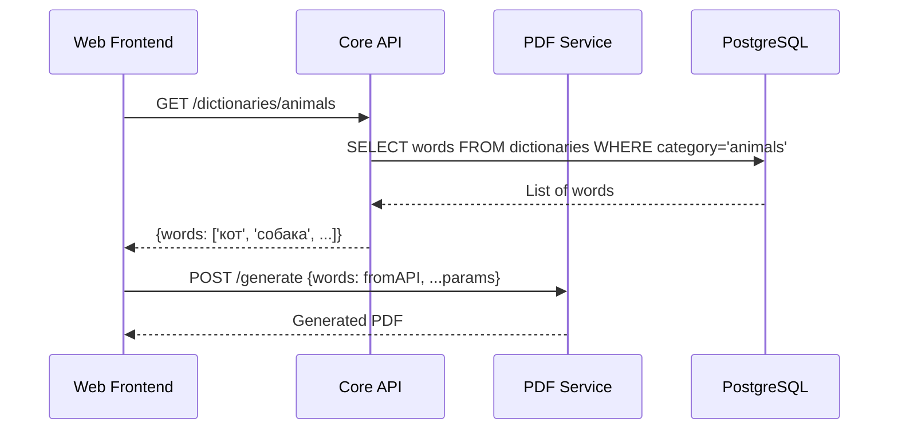

# Архитектура системы

## Обзор архитектуры

Проект построен по принципу **модульной архитектуры** с четким разделением ответственности:

```
┌─────────────────┐    HTTP/REST    ┌─────────────────┐
│                 │ ──────────────► │                 │
│   Web Frontend  │                 │   PDF Service   │
│   (Next.js)     │ ◄────────────── │  (Playwright)   │
└─────────────────┘                 └─────────────────┘
         │                                   │
         │ HTTP/REST                         │ File System
         │ (опционально)                     ▼
         ▼                           ┌─────────────────┐
┌─────────────────┐                  │                 │
│                 │                  │ File Storage    │
│   Core API      │                  │ (S3/MinIO)      │
│ (генераторы)    │                  └─────────────────┘
└─────────────────┘
         │
         │ Database
         ▼
┌─────────────────┐
│                 │
│   PostgreSQL    │
│   + Redis       │
└─────────────────┘
```

## Компоненты системы

### 1. Web Frontend (services/web/)

**Технологии:** Next.js, React, TypeScript
**Ответственность:**
- Пользовательский интерфейс и UX
- Валидация пользовательского ввода- `GET /health` - проверка состояния сервиса
- `GET /metrics` - метрики производительности

**Архитектура PDF Service:**
```
HTTP Request → Validation → Template Engine → Playwright → PDF → Response
     │              │             │              │         │
     │              │             │              │         └─ File Storage
     │              │             │              └─ Chromium Process  
     │              │             └─ Handlebars/EJS
     │              └─ Zod Schema
     └─ Express Middleware
```

### 3. Core API (services/api/) - Опционально

**Технологии:** Node.js, Fastify/NestJS, Prisma
**Ответственность:**
- Бизнес-логика генераторов (алгоритмы размещения слов)
- Управление словарями и категориями
- Пользовательские сессии и настройки (будущее)
- API для мобильных приложений (будущее)

**Когда включается:**
- При появлении второго генератора
- При необходимости общих словарей между сервисами
- При добавлении пользовательских аккаунтов

### 4. Хранилище данных

**PostgreSQL:**
- Словари слов по категориям
- Пресеты конфигураций
- Пользовательские настройки (будущее)
- Статистика использования

**Redis:**  
- Кэш сгенерированных PDF (key: hash параметров)
- Rate limiting по IP
- Сессии пользователей (будущее)

**S3/MinIO:**
- Готовые PDF файлы
- Превью изображения (будущее)
- Резервные копии

## Детальные потоки данных

### Сценарий 1: Генерация филворда



### Сценарий 2: Использование словарей (с Core API)



## Принципы архитектуры

### 1. Разделение ответственности (Separation of Concerns)
- **UI логика** только во Frontend
- **Бизнес-логика** в Core API  
- **Рендеринг** изолирован в PDF Service
- **Данные** централизованы в БД

### 2. Слабая связанность (Loose Coupling)
- Сервисы общаются только через HTTP API
- Каждый сервис может быть заменен независимо
- Нет прямых зависимостей между модулями

### 3. Масштабируемость
- Каждый сервис может масштабироваться независимо
- PDF Service - самый ресурсоемкий, может иметь несколько инстансов
- Статические ресурсы выносятся в CDN

### 4. Отказоустойчивость
- Graceful degradation при недоступности сервисов
- Circuit Breaker pattern для внешних вызовов
- Retry логика с exponential backoff

## Схемы развертывания

### MVP развертывание (один сервер)

```
┌─────────────────── Server (8GB RAM, 4 CPU) ──────────────────┐
│                                                               │
│  ┌─ Docker Compose ─────────────────────────────────────┐    │
│  │                                                       │    │
│  │  [Traefik:80,443] ── SSL ──┐                        │    │
│  │           │                  │                        │    │
│  │           ▼                  ▼                        │    │
│  │  [Web:3000] ──────── [PDF Service:3001]             │    │
│  │           │                  │                        │    │
│  │           └─── [PostgreSQL:5432] ───┘                │    │
│  │                       │                               │    │
│  │                 [Redis:6379]                         │    │
│  │                                                       │    │
│  └───────────────────────────────────────────────────────┘    │
└───────────────────────────────────────────────────────────────┘
```

### Продакшен развертывание (микросервисы)

```
┌─── Load Balancer ────┐
│                      │
├─ [Web Service x2] ───┼─── [Core API x2] ─── [PostgreSQL Primary]
│                      │           │                    │
├─ [PDF Service x3] ───┘           │              [PostgreSQL Read Replica]  
│                                  │                    │
└─ [Redis Cluster] ────────────────┘              [Redis Sentinel]
                                   
┌─── File Storage ─────┐
│ [MinIO Cluster x3]   │
└──────────────────────┘
```

## Безопасность

### Аутентификация и авторизация (будущее)
- JWT токены для API доступа
- Rate limiting по IP и пользователю
- CORS настройки для кросс-доменных запросов

### Валидация данных
- Входные параметры валидируются на всех уровнях
- Sanitization пользовательского ввода
- Ограничения на размер и количество слов

### Сетевая безопасность  
- HTTPS везде (Let's Encrypt)
- Внутренняя сеть между сервисами
- Firewall правила для доступа к БД

## Мониторинг и логирование

### Метрики (Prometheus + Grafana)
- Время генерации PDF по размерам сетки
- Количество запросов в секунду  
- Использование памяти Chromium процессов
- Hit rate кэша Redis

### Логи (Winston + ELK)
- Структурированные JSON логи
- Trace ID для отслеживания запросов
- Error tracking с Sentry
- Performance профилирование

### Алерты
- Время генерации > 30 секунд
- Error rate > 5%
- Memory usage > 90%
- Disk space < 10%

## Планы эволюции архитектуры

### Фаза 1: MVP (текущая)
- Монолитное развертывание
- Базовые функции филворда
- Простое кэширование

### Фаза 2: Масштабирование (3-6 месяцев)
- Несколько инстансов PDF Service
- Redis Cluster
- CDN для статики
- Core API выделяется в отдельный сервис

### Фаза 3: Платформа (6-12 месяцев)  
- Микросервисная архитектура
- Event-driven communication
- Kubernetes оркестрация
- Multi-region deployment

### Фаза 4: Экосистема (12+ месяцев)
- API для третьих сторон
- Мобильные приложения  
- ML рекомендации контента
- Интеграции с LMS системами
